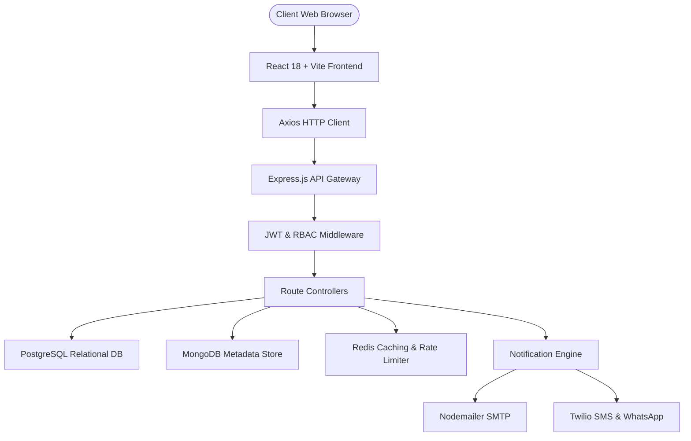
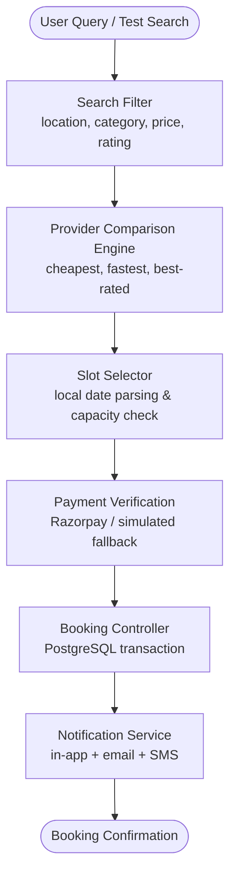
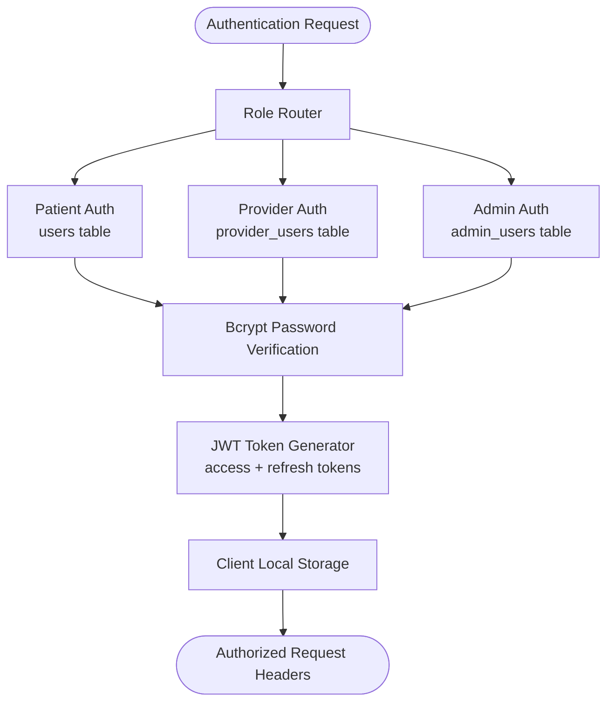
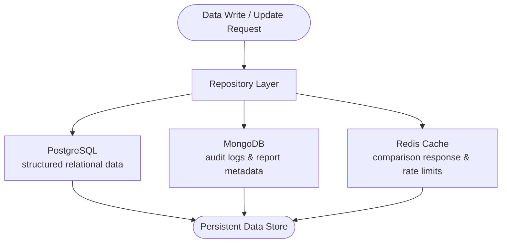
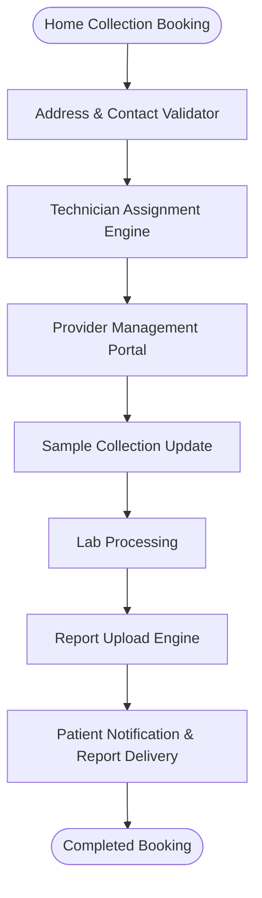
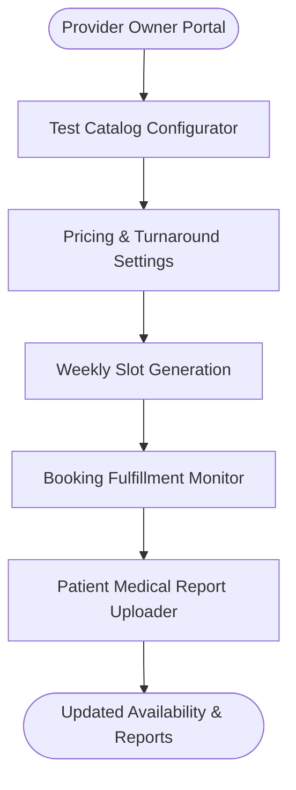
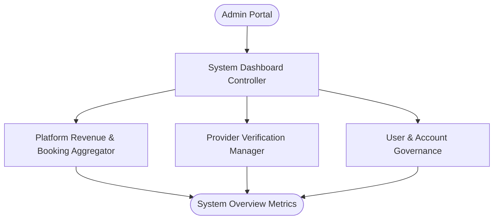

# MediFinder — Flow Diagrams

> These diagrams reflect the actual implementation in `backend/` and `frontend/`.

MediFinder supports three distinct actor workflows across the diagnostic booking lifecycle:
- **Patients / Users**: Search diagnostic tests, compare prices & turnaround times, book center visits or home collection slots, and download medical reports.
- **Healthcare Providers**: Manage test catalog, adjust pricing, configure slot capacities, assign home collection technicians, and upload completed reports.
- **Platform Administrators**: Oversee platform stats, monitor booking distributions, verify healthcare providers, and manage system users.

---

## 1. System Architecture Overview

---

## 2. Patient Booking & Slot Reservation Flow

---

## 3. Multi-Tier Authentication & RBAC Flow

---

## 4. Multi-Database Data Management Flow

---

## 5. Home Sample Collection & Technician Workflow

---

## 6. Provider Portal Management Flow

---

## 7. Admin Platform Oversight Flow

